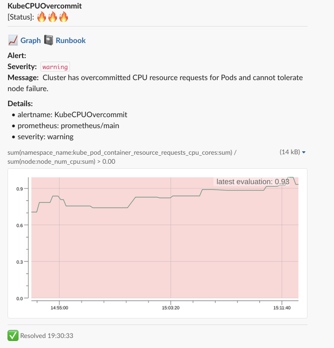

## What is PromAlert?
Yet another [Prometheus](https://prometheus.io/) Alertmanager webhook processor inspired by [qvl/promplot](https://github.com/qvl/promplot)

## How it works 
Receive webhook from Alertmanager, draw images from alert expression, upload pictures to S3 bucket, generate public links, send a notification to Slack. 

## Why Promalert?

Standard prometheus slack receiver cant use threads and draw graphs from alert.

Main features: 
* Threads to keep alert channel informative
* Updating init firing message, mark it as resolved
* Graph rendering with metric and alert level

### Message logic

Post the new message in case when we can find a reference in the history [example](docs/images/nan_points_in_metric_graph.png). 

Otherwise, based on the status of the message, we apply the following logic:

_Status = Firing_

Post full message to thread with broadcasting. Set refiring footer to last known firing message. Store link to this message in memory (next resolving updates will edit this message) [example](docs/images/refired_message.png).

_Status = Resolved_

Post short message (header + images) to thread [example](docs/images/resolved_thread.png). Update footer of last fired message [example](docs/images/resolved_init_maessage.png). 

## Installation

### Helm chart

> Coming soon

### Docker 

Use [env file](https://docs.docker.com/engine/reference/commandline/run/#set-environment-variables--e---env---env-file) to store required params
```bash
docker run -p 8080:8080 --env-file env.list kuzaxak/promalert
```

## Configuration
The following tables list the configurable parameters of the PromAlert and their default values.

You can use a YAML configuration file or env variable. Package [viper](https://github.com/spf13/viper) used to parse them.
Environment variables prefix: `PROMALERT_`

*Required params:*

| Parameter        | Description           | Env variable               |
|:-----------------|:----------------------|:---------------------------|
| `slack_token`    | OAuth bot token       | `PROMALERT_SLACK_TOKEN`    |
| `slack_channel`  | Slack channel to send | `PROMALERT_SLACK_CHANNEL`  |
| `prometheus_url` | Prometheus URL        | `PROMALERT_PROMETHEUS_URL` |
| `s3_bucket`      | S3 bucket name        | `PROMALERT_S3_BUCKET`      |
| `s3_region`      | S3 region             | `PROMALERT_S3_REGION`      |

*Additional params:*

| Parameter           | Description                                       | Default                                          |
|:--------------------|:--------------------------------------------------|:-------------------------------------------------|
| `http_port`         | HTTP port                                         | `8080`                                           |
| `metric_resolution` | Amount of point on the graph                      | `100`                                            |
| `debug`             | Verbose log output. Dump HTTP request to log      | `false`                                          |
| `message_template`  | Slack message template. Go template syntax        | [`config.example.yaml`](config.example.yaml#L18) |
| `header_template`   | Slack message header template. Go template syntax | [`config.example.yaml`](config.example.yaml#L11) |
| `footer_template`   | Slack message footer template. Go template syntax | [`config.example.yaml`](config.example.yaml#L15) |

### AWS
AWS credentials parsed by [aws-go-client](https://github.com/aws/aws-sdk-go) in the following [order](https://github.com/aws/aws-sdk-go#configuring-credentials):
1. Environment variables.
1. Shared credentials file.
1. If your application is running on an Amazon EC2 instance, IAM role for Amazon EC2.

### Message templating

Template applies per alert in group. Data in the template `.` = [Alert](types.go#L21)

Available functions:

| Func       | Arguments           | Description              | Example                           |
|:-----------|:--------------------|:-------------------------|:----------------------------------|
| toUpper    | string              | Format text to Uppercase | `{{ .Status | toUpper }}`         |
| dateFormat | format string, time | Format date/time         | `{{ dateFormat "15:04:05" now }}` |
| now        |                     | Retrieve current time    | `{{  now.String }}`               |

Default message template: 
```gotemplate
  :chart_with_upwards_trend: *<{{ .GeneratorURL }}|Graph>*
  {{- if .Labels.runbook }} :notebook: *<{{ .Labels.runbook }}|Runbook>*{{ end }}
  {{- if .Annotations.runbook_url }} :notebook: *<{{ .Annotations.runbook_url }}|Runbook>*{{ end }}

  *Alert:* {{ if .Annotations.title }}{{ .Annotations.title }}{{ end }}{{ if .Annotations.summary }}{{ .Annotations.summary }}{{ end }}
  {{ if .Labels.severity }}*Severity:*  `{{ .Labels.severity }}`{{ end }}
  {{ if .Annotations.message }}*Message:*  {{ .Annotations.message }}{{ end }}
  {{ if .Annotations.description }}*Description:* {{ .Annotations.description }}{{ end }}
  *Details:*
    {{ range $key, $value := .Labels }} • {{ $key }}: {{ $value }}
    {{ end }}
```

Header template:
```gotemplate
  *{{ .Labels.alertname }}*
  [Status]: {{if eq .Status "firing" }}:fire::fire::fire:{{else}}:white_check_mark::white_check_mark::white_check_mark:{{ end }}
```

Footer template:
```gotemplate
  {{if eq .Status "firing" }}:fire: Refired{{else}}:white_check_mark: Resolved{{ end }} {{ dateFormat "15:04:05" now }}
```

Rendered message:




## Build 
```
docker build --rm -t promalert .
```

## Bug Reporting

To submit a bug report use the GitHub bug tracker for the project:

[Github Issues](https://github.com/kuzaxak/promalert/issues)

## License

GNU Lesser General Public License v3.0

See [LICENSE](LICENSE) to see the full text.